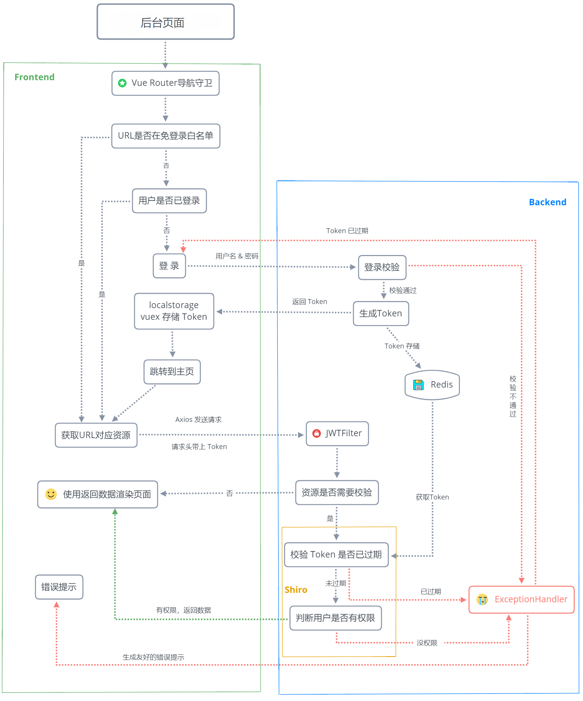

幾盤【后台】工程
 - 目的是为后面小程序、app、webapp后端开发提供脚手架，已经全部通过jwt 将整个工程前后端完全分离。  
 
 - 技术选型：  
    * Spring Boot 2.1.0
    * Mybatis,Mybaits Plus （自行调研）
    * MySQL 5.7,Hikari,Redis
    * Shiro,JWT
    
 - 如何使用:
    * IDEA安装lombok插件
    * 新建MySQL（版本5.7.x）数据库，导入SQL文件
    * 修改数据库配置，redis配置
    * 启动项目
      
 - 流程:
    